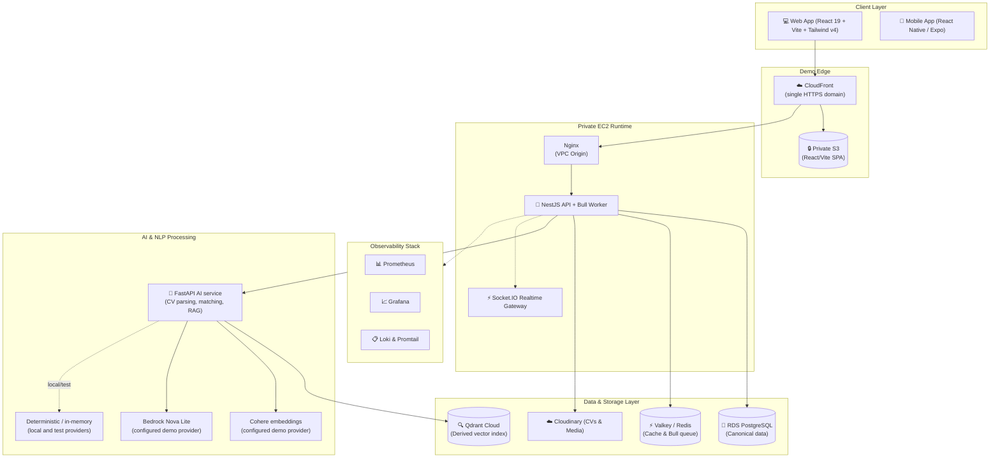

<div align="center">
  
  
  <p align="center">
    <strong>Hệ thống Tuyển dụng & Kết nối Việc làm Thông minh tích hợp AI</strong>
  </p>

  <p align="center">
    <a href="#-tổng-quan-dự-án">Tổng quan</a> •
    <a href="#-kiến-trúc-hệ-thống">Kiến trúc</a> •
    <a href="#-công-nghệ-sử-dụng">Công nghệ</a> •
    <a href="#-cài-đặt--khởi-chạy">Cài đặt & Khởi chạy</a> •
    <a href="#-cấu-trúc-thư-mục">Cấu trúc thư mục</a> •
    <a href="FEATURES.md">Chi tiết chức năng (FEATURES.md)</a>
  </p>

  <p align="center">
    
    
    
    
    
    
    
    
    
  </p>
</div>

---

## 📌 Tổng quan dự án

**TalentPulse** là nền tảng tuyển dụng trực tuyến thế hệ mới, kết nối ứng viên và nhà tuyển dụng thông qua sức mạnh của **Trí tuệ Nhân tạo (AI & NLP)**. Hệ thống giải quyết bài toán tuyển dụng truyền thống bằng cách tự động hóa quy trình sàng lọc hồ sơ, xếp hạng ứng viên theo độ tương đồng ngữ nghĩa, và hỗ trợ định hướng nghề nghiệp thông minh.

### 🌟 Điểm nổi bật
- 🤖 **AI Matching & Candidate Ranking**: Tính toán độ tương đồng ngữ nghĩa (Embedding + Cosine Similarity) giữa CV và mô tả công việc (JD), tự động chấm điểm và xếp hạng ứng viên.
- 💬 **AI Career Assistant & CV Analysis**: Chatbot RAG (Retrieval-Augmented Generation) phân tích CV, phát hiện kỹ năng còn thiếu và tư vấn cải thiện hồ sơ.
- 📍 **Nearby Jobs (PostGIS)**: Tìm kiếm việc làm xung quanh vị trí hiện tại của ứng viên theo bán kính (5km, 10km, 20km,...).
- ⚡ **Realtime Communication**: Nhắn tin trực tiếp thời gian thực giữa Nhà tuyển dụng & Ứng viên qua WebSockets (Socket.IO).
- 🌐 **Đa ngôn ngữ & Giao diện hiện đại**: Hỗ trợ Song ngữ (Tiếng Việt / English), Dark/Light mode, hiệu ứng mượt mà chuẩn **Castify & UI-UX Pro Max**.
- 💎 **Hệ sinh thái Premium**: Gói dịch vụ cao cấp cho Candidate (Hồ sơ nổi bật, Phân tích cạnh tranh) và HR (Tin Hot, Tìm kiếm nâng cao).

Chi tiết toàn bộ đặc tả chức năng: [FEATURES.md](FEATURES.md).

---

## 🏗 Kiến trúc hệ thống



---

## 🛠 Công nghệ sử dụng

| Tầng / Thành phần | Công nghệ & Thư viện chính |
| :--- | :--- |
| **Frontend Web** | React 19, TypeScript, Vite 6, Tailwind CSS v4, Framer Motion, Lucide React, i18next |
| **Backend API** | NestJS, TypeORM, Passport JWT, Socket.IO, `@nestjs/bull` + Bull, Class Validator |
| **Cơ sở dữ liệu** | PostgreSQL 16 + PostGIS; PostgreSQL là nguồn dữ liệu canonical |
| **Caching & Queue** | Redis-compatible Valkey/Redis, Bull |
| **Tìm kiếm & Vector** | Qdrant Cloud là derived vector index; structured business data vẫn ở PostgreSQL |
| **AI & Xử lý ngôn ngữ** | FastAPI, Cohere `cohere.embed-multilingual-v3` (1024 dimensions), Bedrock `amazon.nova-lite-v1:0`, deterministic local/test providers, PDF/DOCX parsers |
| **Thanh toán** | Cổng thanh toán trực tuyến PayOS |
| **Giám sát (Observability)** | Prometheus, Grafana, Loki, Promtail |
| **Triển khai & Hạ tầng** | CloudFront, private S3 SPA, private EC2/Nginx, Docker Compose, RDS PostgreSQL, Cloudinary |

---

### 🎯 Demo EC2 + CloudFront

Topology demo dùng một CloudFront domain HTTPS: frontend production được phục vụ
từ private S3, còn `/api/*` và `/socket.io/*` đi qua CloudFront VPC Origin tới
Nginx trên private EC2. Nginx chuyển tiếp tới NestJS, Bull/Valkey và FastAPI;
NestJS sở hữu authorization, PostgreSQL/RDS, Cloudinary và các workflow nghiệp vụ.

Frontend production gọi API cùng origin qua `/api/v1`; Socket.IO dùng cùng origin.
Qdrant Cloud chỉ giữ derived job vectors. Cohere embeddings và Bedrock Nova Lite đã
được cấu hình cho demo; local/development/test vẫn dùng deterministic embedding,
in-memory retrieval và deterministic generation. AWS admission và one-shot provider
smoke tests vẫn cần được hoàn tất trước khi release được chấp nhận.

### Current implementation contract

- **NestJS** owns business APIs, authorization, PostgreSQL/RDS canonical persistence,
  job lifecycle, transactional outbox, and job-indexing orchestration. It owns the
  canonical job data and calls FastAPI for AI indexing operations.
- **FastAPI** owns CV parsing, deterministic CV-job matching, RAG, embeddings, and
  provider-specific indexing adapters. **Qdrant Cloud** is a derived vector index,
  not the business source of truth.
- The demo topology is **CloudFront + private S3 SPA** at the edge, forwarding API
  traffic to **private EC2/Nginx**, where NestJS, FastAPI, and Valkey run. Canonical
  data is in **RDS PostgreSQL** and derived vectors are in **Qdrant Cloud**.
- FastAPI health endpoints are `/health`, `/health/live`, and `/health/ready`.
  NestJS health endpoints are `/api/v1/health` and `/api/v1/health/ready`.
  Nginx exposes `/origin-health`.
- AI scopes are `cv:parse`, `cv:match`, `rag:retrieve`, `rag:generate`, and
  `jobs:index`; the indexing scope is configured with `AI_JOB_INDEX_SCOPE`.
  Indexing routes are `POST /internal/v1/index/jobs/upsert` and
  `POST /internal/v1/index/jobs/delete`.
- Demo vector settings are collection
  `jobs_cohere_multilingual_v3_1024_demo_v1`, alias `jobs_current_demo`, and
  version `demo-v1`. Cohere uses `cohere.embed-multilingual-v3` with 1024
  dimensions; generation uses Bedrock `amazon.nova-lite-v1:0`. The approved IAM
  Bedrock ARN must correspond to the runtime model/profile, rather than a wildcard.
- Matching reports semantic 50%, skills 35%, and experience/level 15%.
  Location and work-mode compatibility are reported separately and are not part of
  the numeric score.

---

## 🚀 Cài đặt & Khởi chạy

### 1. Yêu cầu môi trường (Prerequisites)
- [Node.js](https://nodejs.org/) (phiên bản $\ge$ 20.x) & `npm`
- [Docker](https://www.docker.com/) & Docker Compose
- [Git](https://git-scm.com/)

---

### 2. Khởi chạy Hạ tầng dịch vụ (Infrastructure)
Khởi động các dependency local và monitoring được khai báo trong Docker Compose:

```bash
# Di chuyển vào thư mục cấu hình môi trường
cd backend/environment

# Khởi chạy các dependency local và observability được khai báo trong Compose
docker-compose up -d
```

Các dịch vụ sẽ chạy tại:
- **PostgreSQL**: `localhost:5432`
- **Redis**: `localhost:6379` (cache và Bull queue)
- **Grafana Dashboard**: `localhost:3001` (admin/admin)
- **Prometheus**: `localhost:9090`

---

### 3. Khởi chạy Backend (NestJS)

```bash
# Di chuyển vào thư mục backend
cd backend

# Cài đặt dependencies
npm install

# Tạo file biến môi trường từ mẫu
cp .env.example .env

# Chạy backend ở chế độ Development
npm run start:dev
```
Backend API sẽ hoạt động tại: `http://localhost:8000/api/v1`

---

### 4. Khởi chạy Frontend (React Vite)

```bash
# Di chuyển vào thư mục frontend
cd frontend

# Cài đặt dependencies
npm install

# Tạo file biến môi trường từ mẫu
cp .env.example .env

# Khởi chạy frontend dev server
npm run dev
```
Giao diện Web sẽ hoạt động tại: `http://localhost:5173/`

---

## 📁 Cấu trúc thư mục

```
BTL_Mobile/
├── .agents/                    # Workspace Rules, Skills (Frontend, Design, Backend, Graphify)
├── backend/                    # Mã nguồn Backend NestJS
│   ├── environment/            # Docker Compose & cấu hình Observability (Prometheus, Loki, Grafana)
│   ├── src/                    # 14 modules nghiệp vụ (users, jobs, companies, applications, ai-matching,...)
│   └── test/                   # E2E test suites
├── frontend/                   # Mã nguồn Frontend React Vite
│   ├── public/                 # Assets tĩnh & Logo SVGs (Dark/Light mode)
│   └── src/
│       ├── components/         # UI components & Landing page sections
│       ├── context/            # ThemeContext (Dark/Light mode)
│       ├── i18n/               # Đa ngôn ngữ (Tiếng Việt / English)
│       └── pages/              # Các trang giao diện (LandingPage,...)
├── graphify-out/               # AST Knowledge Graph tối ưu hoá tra cứu mã nguồn
├── FEATURES.md                 # Đặc tả chi tiết toàn bộ chức năng hệ thống
├── AGENTS.md                   # Hướng dẫn & Tiêu chuẩn phát triển cho Agent
└── README.md                   # Tài liệu hướng dẫn chính của Repository
```

---

## 🧭 Hướng dẫn phát triển với Agent (Graphify & Skills)

Repository này được tích hợp hệ thống **Graphify Knowledge Graph** và bộ kỹ năng chuyên biệt trong `.agents/skills/`:

- **Graphify Tra cứu mã nguồn**: Khi cần tìm kiếm logic nghiệp vụ mà không tốn token, chạy `graphify query "<từ khóa>"` hoặc `graphify explain "<module>"`.
- **Frontend & Design System**: Tuân thủ quy chuẩn thiết kế tại `.agents/skills/frontend/RULES.md` (chuẩn WCAG AA, không dùng emoji làm icon, 3D perspective mockup, Aurora gradients, Bento Grid).
- **Backend Architecture**: Tuân thủ mẫu TypeORM repository, UUID primary key, Soft Delete tại `.agents/skills/backend/SKILL.md`.

---

## 📄 Bản quyền (License)

Dự án phục vụ mục đích học tập và nghiên cứu (BTL Mobile & Fullstack Project). Mọi quyền được bảo lưu.
